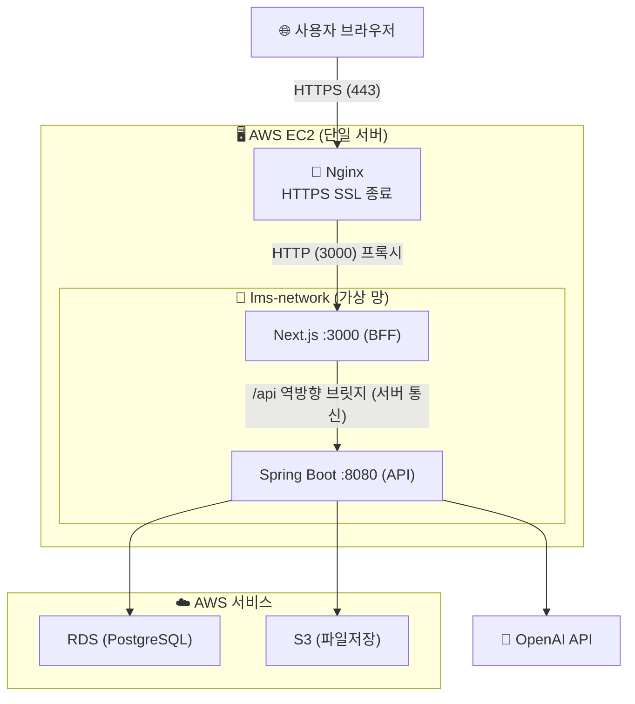

# Team-LMS Portfolio (Fullstack / Infra)

> (공공 SI) **관리자/학생/교수 LMS 플랫폼** 팀 프로젝트 포트폴리오입니다.  
> 원본 코드는 **팀 Org 레포**에 있으며, 이 레포지토리는 본인의 **풀스택 개발 및 인프라 설계 기여도**를 중심으로 요약한 개인 포트폴리오 페이지입니다.

## Links
- Service (Live): https://teamlms.duckdns.org
- Org Repository (Source): https://github.com/team-lms-2026-1/LMS-project
- Portfolio Repo (this): (본인 포트폴리오 링크로 변경 권장)

---

## Demo Video
*(기존 PM 포트폴리오와 동일한 데모 영상을 쓰거나, 본인 개발 부분 데모 영상으로 교체 가능)*

---

## My Role / Contribution
**개발 포지션: Fullstack & Infrastructure**

### 1. Infrastructure & DevOps (100% 전담)
- 단일 EC2 기반의 Nginx + Docker(Next.js, Spring Boot) 운영 환경 아키텍처 구축
- Frontend/Backend 도메인 특성에 맞춘 이원화된 GitHub Actions CI/CD 파이프라인 자동화
- AWS 서비스(RDS PostgreSQL, S3) 연동 및 VPC/Security Group 통합 격리망 구축
- Flyway를 활용한 DB 스키마(Migration) 버전 관리 설계
- Next.js 기반 BFF(Backend-For-Frontend) 패턴을 통한 보안 통신(HttpOnly Cookie) 구조 확립

### 2. Fullstack Development (Backend + Frontend)
- **설문조사(Surveys):** 문항 생성 로직 설계, 답변 수집 및 통계 대시보드 풀스택 연동
- **멘토링(Mentoring):** 교수-학생 간 멘토링 세션 신청/승인/내역 추적에 대한 도메인 로직 및 UX 개발
- **비밀번호 재설정:** 안전한 토큰 검증 기반의 사용자 비밀번호 초기화/재설정 플로우 구현

### 3. Frontend Development
- **계정 로그 관리(Account Log):** 관리자 환경에서의 사용자 접속 시점 및 활동 내역(Audit) 조회 화면 모듈화
- **학과 관리(Department Admin):** 직관적인 인터페이스의 학과 CUD (생성/수정/삭제) 및 목록 확인 페이지 컴포넌트 개발

---

## Technical Highlights (My Problem Solving)
특히 **안정적인 시스템 인프라 시나리오 구축** 및 **BFF 패턴을 통한 인증/보안 아키텍처 설계**에 힘을 쏟았습니다.

### 1. 운영 환경을 고려한 프론트/백엔드 맞춤형 CI/CD 이원화 구축
단순 획일적인 파이프라인 구성에서 벗어나, 런타임 특성이 다른 두 서비스의 빌드 속도 및 안정성을 최적화했습니다.
- **Frontend 배포 (`frontend-deploy.yml`)**: Node.js 환경의 의존성을 완벽히 통제하기 위해 **멀티 스테이지 도커 빌드(Multi-stage build)**를 활용. 실행에 필요한 파일들만 압축한 단일 이미지를 빌드하여 `GHCR`에 배포하고, EC2가 이를 풀(Pull)하여 실행하게 구현.
- **Backend 배포 (`deploy.yml`)**: 매번 무거운 이미지를 굽는 낭비를 막기 위해, 로컬(CI환경)에서 컴파일된 `app.jar` 만 EC2로 가볍게 넘기는 **SCP 전송 방식**을 채택. 가벼운 공식 자바 도커 이미지(`eclipse-temurin`)에 실행 파일만 갈아 끼워 실행시켜 **배포 소요 시간을 극적으로 단축**했습니다.

### 2. BFF (Backend-For-Frontend) 채택으로 토큰 관리/보안 원천 강화
로컬 스토리지에 JWT 토큰을 두는 흔한 방식의 인증/탈취 취약성과 CORS 정책을 해결하기 위해, Next.js 프론트엔드 환경을 BFF 레이어로 승격시켜 활용했습니다.
- 사용자는 `HttpOnly Cookie` 형태로만 토큰을 갖게 되며 브라우저(JS)에서 접근할 수 없어 탈취 위험을 없앴습니다.
- 브라우저는 BFF 역할을 하는 Next.js API 도메인과 통신하여 **CORS 정책 오류를 피하고**, Next.js 라우트가 쿠키에서 토큰을 추출해 백엔드 API 요청 시 `Authorization: Bearer <token>` 헤더를 서버 투 서버(Server-to-Server) 로 꽂아주는 보안 브릿지 역할을 구현해 냈습니다.

### 3. 단일 서버 컨테이너 네트워크 리소스 격리 통제
- EC2 인바운드 보안그룹은 가장 필수적인 22(SSH), 80(HTTP), 443(HTTPS) 포트만 열어두고, Nginx 설정에서 프록시 서버만 통과하게 하여 **가상 서버의 애플리케이션 서비스 포트(`3000`, `8080`) 노출을 완벽히 차단**했습니다.
- 도커 내부에 `lms-network`라는 프라이빗 브릿지 가상망을 구성, Next.js 화면과 Spring Boot 서버가 오직 EC2 내부망에서만 서로를 바라보며 데이터 흐름을 제한하도록 조치했습니다.
- **AWS RDS 또한 인바운드를 EC2 내부의 특정 보안그룹 전용으로 한정**하여 데이터베이스 외부 해킹 시도를 봉쇄했습니다.

### 4. Flyway를 활용한 DDL 마이그레이션 관리 자동화
개발 및 유지보수 과정에서 테이블 및 컬럼 변경이 잦은 점을 고려해 수동 쿼리 실행으로 인한 버전 불일치 휴먼 에러를 방지했습니다. 
- `Flyway` 모듈을 연동해 `.sql` 버전 관리가 형상관리(Git)와 함께 물리도록 구성. GitHub Actions 백엔드 빌드 후 실행 파일이 교체되어 서버가 부트스트랩될 때 DB 스키마가 로직에 맞게 스스로 최신 상태 코드로 마이그레이션되도록 자동화했습니다.

---

## 🏗️ Architecture & Infrastructure Structure

*(ec2_architecture.md 에 구상하신 내용을 이미지 모델링한 후 하단에 교체하셔도 됩니다.)*

---

## Tech Stack

### Web & Backend Stack
- **Frontend / BFF**: Next.js 14, React
- **Backend 서버**: Java 17, Spring Boot 3.5.9, Spring Security (JWT)
- **Database**: PostgreSQL 16 (AWS RDS 연동), Flyway (DB Migration)

### DevOps & Infrastructure
- **Serverless/Cloud**: AWS EC2 (VM 호스팅), AWS S3 (오브젝트 스토리지 연동)
- **Container 기술**: Docker, Docker Compose
- **CICD 자동화**: GitHub Actions, GHCR(GitHub Container Registry)
- **네트워크 웹서버**: Nginx, Let's Encrypt(certbot 등)

---

## UI Screenshots (My Works)
*(설문, 멘토링 화면 또는 시스템 학과관리 창 등으로 스크린샷 교체를 추천합니다)*
| 설문(Survey) 관리 화면 | 멘토링(Mentoring) 내역 | 사용자(계정) 로그 내역 |
|---|---|---|
| (예시)  | (예시)  | (예시)  |

---

## ERD
- 상세 ERD 문서: [ERD 상세 보기](docs/ERD.md)

---

## Demo Accounts
> 데모용 계정이며 비밀번호는 운영상 변경될 수 있습니다.

- **Admin**: `a20001122` / `Admin!2345`
- **Professor**: `p20260001` / `Professor!2345`
- **Student**: `s20260001` / `Student!2345`
